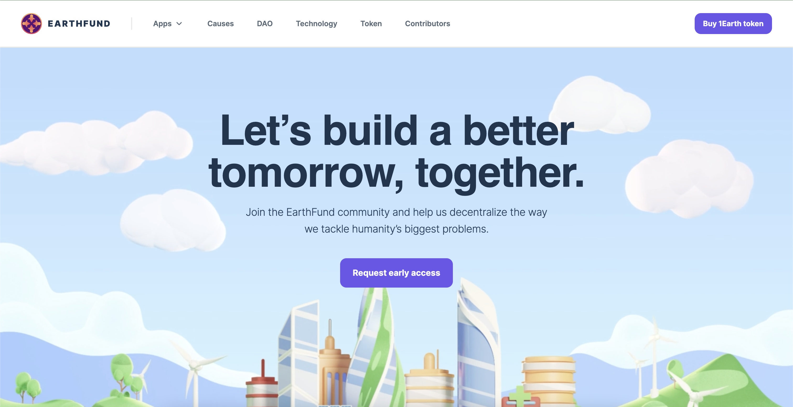
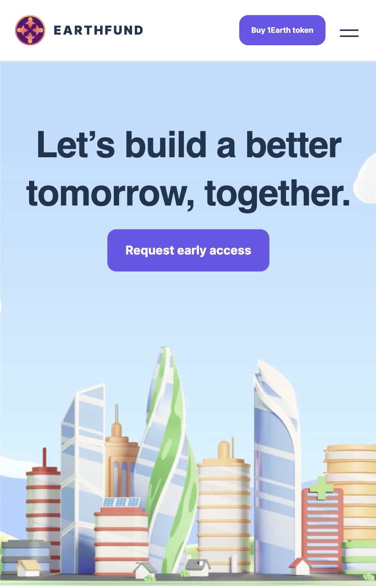

# Universidad del Valle - Sistemas y Tecnologías Web 2022

Este proyecto es una réplica de el sitio [EARTHFUND](https://earthfund.io/).
Este es el [RESULTADO](http://ec2-54-175-28-151.compute-1.amazonaws.com:4000/)

## Table of contents

- [Resumen](#resumen)
  - [Features](#features-que-se-implementaron)
  - [Screenshot](#screenshot)
  - [Links](#links)
- [Procedimiento](#procedimiento)
  - [Tecnologías](#tecnologías)
  - [Cosas que aprendí](#cosas-que-aprendí)
- [Autor](#autor)

## Resumen

### Features que se implementaron

- El sitio es totalmente responsive.
- Paleta de colores.
- Efecto Parallax Simple.
- Animaciones en scroll.

### Screenshots




## Procedimiento

Para este proyecto empecé con una instalación de React utilizando Webpack y Babel. Posteriormente tuve que decidir qué patrón utilizar para los estilos. Dado que yo quería implementar todo por mi cuenta para practicar SCSS decidí utilizar el patrón 7-1. El cuál es una guía para distribuír archivos .scss en 7 categorías. Sin embargo, debido a que el proyecto era pequeño solo utilicé 4 folders: `abstracts`, `base`, `components`, y `layout`. Cada folder tiene una función diferente. Por ejemplo en el folder base está todo lo que tiene que ver con el estilo base de el sitio en general: fonts, clases de utilidad, etc. En el folder abstrscts se encuentran las variables y mixins de sass. El folder de layout define cómo se muestra cada una de las secciones de mi página.
Para mantener mis clases de CSS consistentes utilicé BEM (Block, Elements, Modifiers). Un bloque es una unidad que por sí misma tiene sentido, un elemento pertenece a un bloque y un modifier modifica un elemento. Por ejemplo:

```html
<div className="card">
  <div className="card__title card__title--big">{title}</div>
</div>
```

En este caso `card` es el bloque, `card__title` es un elemento y `--big` es un modificador.

### Tecnologías

- HTML5
- SASS
- Flexbox
- CSS Grid
- [Patrón 7-1 para estilos](https://itnext.io/structuring-your-sass-projects-c8d41fa55ed4)
- [Webpack](https://webpack.js.org/)
- [ESLint](https://eslint.org/)
- [React](https://reactjs.org/)
- [Animate.css](https://animate.style/)

### Cosas que aprendí

En este proyecto aprendí a organizar mi código de SASS de una mejor manera. Además, logré utilizar variables de SASS y mixins para facilitar el desarrollo de la páginas. El efecto parallax lo conseguí siguiendo el siguiente [Tutorial](https://indithemes.com/how-to-create-a-simple-parallax-effect-using-vanilla-js/).

## Autor

- Github - [guillermoSb](https://github.com/guillermoSb)
- LinkedIn - [guillermo-santosgt](https://www.linkedin.com/in/guillermo-santosgt/)
